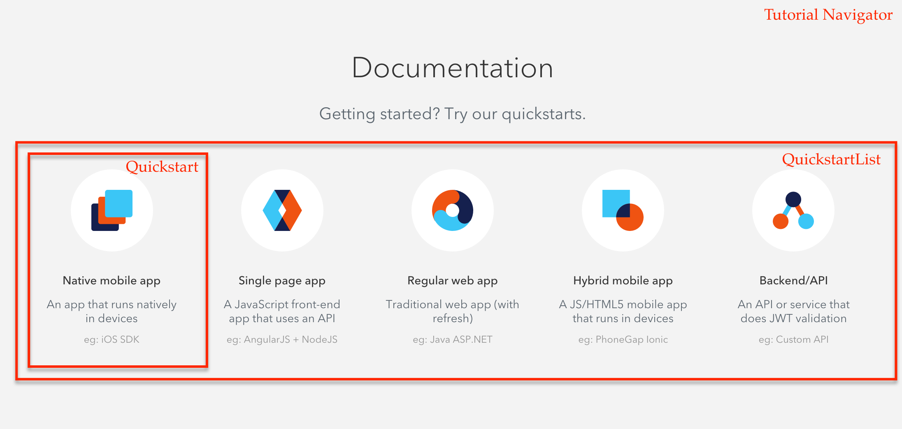
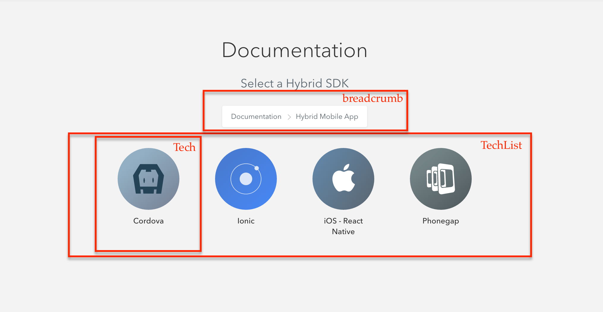
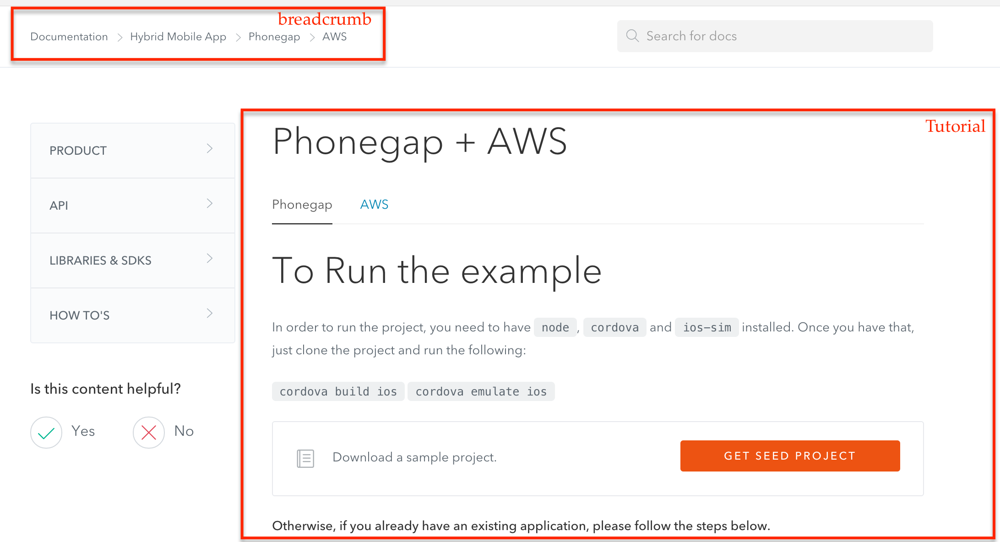

# Auth0 Navigator Tutorial


- [Usage](#usage)
- [Install & Build](#install-build)
	- [From Auth0's CDN, ready to go](#from-auth0s-cdn-ready-to-go)
	- [Downloading from this repository](#downloading-from-this-repository)
	- [Development](#development)
- [API](#api)
- [Component Structure](#component-structure)


## Usage

```js
var TutorialNavigator = require('tutorial-navigator');  
var options = {
    docsDomain : 'https://auth0.com',
    basePath : '/docs',
    singleTpl : $('#tutorial-template'),
    platformsFetchFn : function() {
      return $.ajax({
        url: 'https://auth0.com/docs/meta/quickstart',
        dataType: 'jsonp'
      });
    },
    onTutorialLoad : function($template) {
        $('#tutorial-navigator').addClass('hide');
    },
    onTutorialReset : function($template) {
      $('#tutorial-navigator').removeClass('hide');
    }
};

React.render(
    React.createElement(TutorialNavigator.init, options),
    $('#tutorial-navigator').get(0)
);
```

## Install & Build

### From Auth0's CDN, ready to go

```html
<link rel="stylesheet" type="text/css" href="https://cdn.auth0.com/tutorial-navigator/0.7.2/build.css">
<script type="text/javascript" src="https://cdn.auth0.com/tutorial-navigator/0.7.2/build.js"></script>
```

> You may also use our minified or standalone versions `build.min.*`.

### Downloading from this repository

Run the following lines in your terminal

```bash
$ git clone git@github.com:auth0/tutorial-navigator.git
$ cd tutorial-navigator
$ npm build
```

And then you can get the files from the `build/` folder.

### Development

```bash
$ git clone git@github.com:auth0/tutorial-navigator.git
$ cd tutorial-navigator
$ npm start
```

After that you will have access to [http://localhost:8989/](http://localhost:8989)

## API

This are the list of properties you use to initialize the contorl

|Name             |Type     |Description|Required|
|---|---|---|---|
|docsDomain       |string   | base url used to fetch the tutorial||
|basePath         |string   |||
|selectedTutorial |object   | if set, it will try to load the tutorial ||
|routing          |bool     | if enabled it will use page for routing||
|userTenants      |array    |||
|platforms        |object   | object containing all the information required by the control||
|platformsFetchFn |function | if platforms is not defined, it will use this function to get the platforms from the server. Should return a promise||
|singleTpl        |element  | Element used for parsing the tutorial||
|onTutorialLoad   |function | Event triggered when the tutorial is loaded||
|onTutorialReset  |function | Event triggered when the tutorial is reset||
|onTutorialUpdate |function | Event triggered on navigation| |

## Component Structure

The TutorialNavigator react class contains all the elements and is in charge of mantaining the state.

The grid below the title is the list of Quickstarts  

  

  _Tutorial Navigator and Quickstart list_

When you click on one Quickstart the list is loaded with a list of techonologies

  

  _Tech list_

Once you click on the Techonology the template is requested and loaded in the defined template

  

  _Tutorial Loaded_
